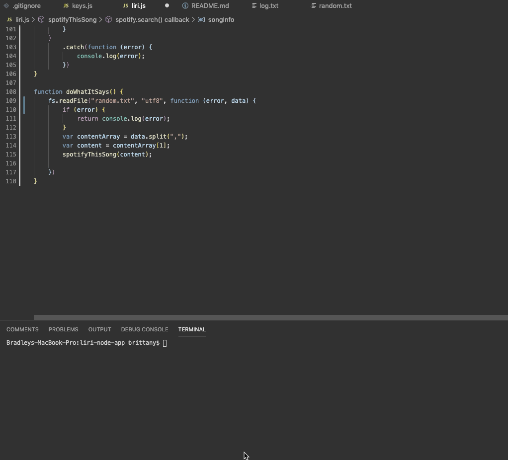

# liri-node-app
The LIRI (Language Interpretation and Recognition Interface) app is a command line node application that takes in parameters that a user enters and then gives a response based on the command chosen by the user. The available commands are:
* concert-this
* spotify-this-song
* movie-this
* do-what-it-says

The application uses switch statements which then call the functions to be used to provide the response. Data from the API's is received by using the axios.get method. Multiple NPM packages and API's are used for this app, which can be seen below.

## How to Use
There are 4 different commands to be used with the LIRI app. 

* Option 1: concert-this
    * Enter node liri.js concert-this <artist-name-here>
    * This command with search the Bands in Town API based on the artist entered and return information about an event for this artist. The information provided will be the name of the venue, the location of the venue, and the date of the event (using Moment to format the date as "MM/DD/YYYY")
    * This data will also be appended to a log.txt file
    

* Option 2: spotify-this-song
    * Enter node liri.js spotify-this-song <song-name-here>
    * Using the Spotify API, users will receive information about a song based on the song they have entered. It will log the artist name, the song name, a preview link to the song from Spotify, along with the album the song is from. This information will also be added to the log.txt file.
    

* Option 3: movie-this
    * Enter node liri.js movie-this <movie-name-here>
    * This command uses the OMDB API and returns information about the movie the user has entered. The console will log the title of the movie, the year it was released, the IMDB rating, the Rotten Tomatoes Rating, country where it was produced, language, the plot, and the actors in the movie. This data also gets appended to log.txt
    

* Option 4: do-what-it-says
    * Enter node liri.js do-what-it-says
    * LIRI will use the text in the random.txt file and call on the spotify-this-song command to provide the data for the song "I Want it That Way" and provide the same data as above for spotify-this-song.
    

A full video of the entire app demonstration can be downloaded from the images file within the repo. The video can also be viewed [here](https://drive.google.com/file/d/18Z6jR09-yA7P_ucQ62f065d3M1LllrDK/view)

## Technologies Used
- Node.js
- Javascript

## NPM/API's
- Bands in Town API
- Spotify API
- OMDB API
- Axios
- Moment
